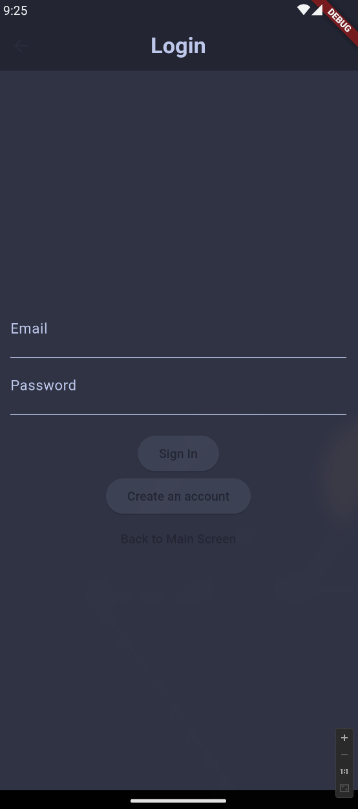
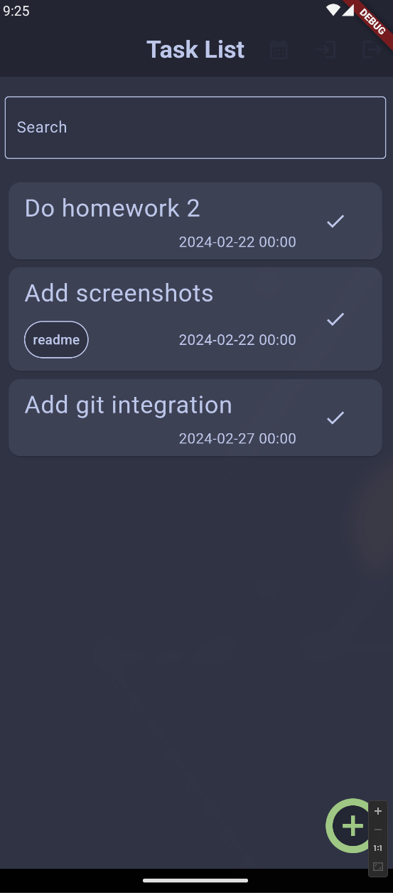
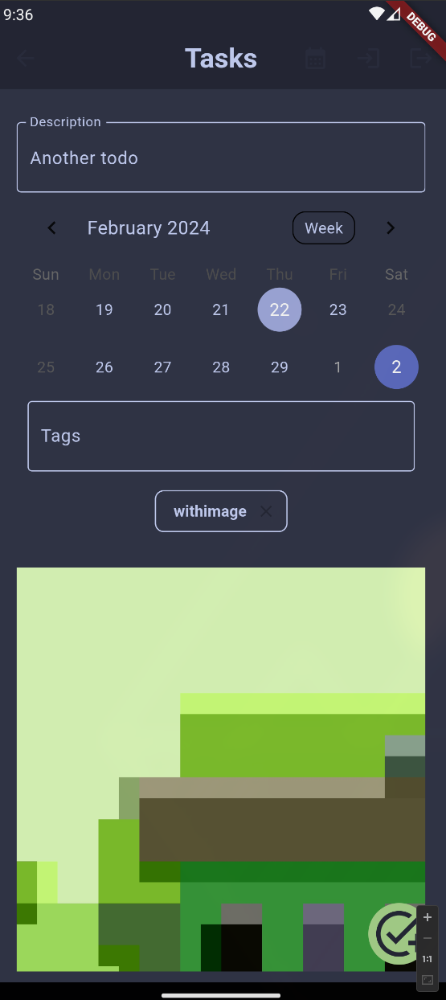
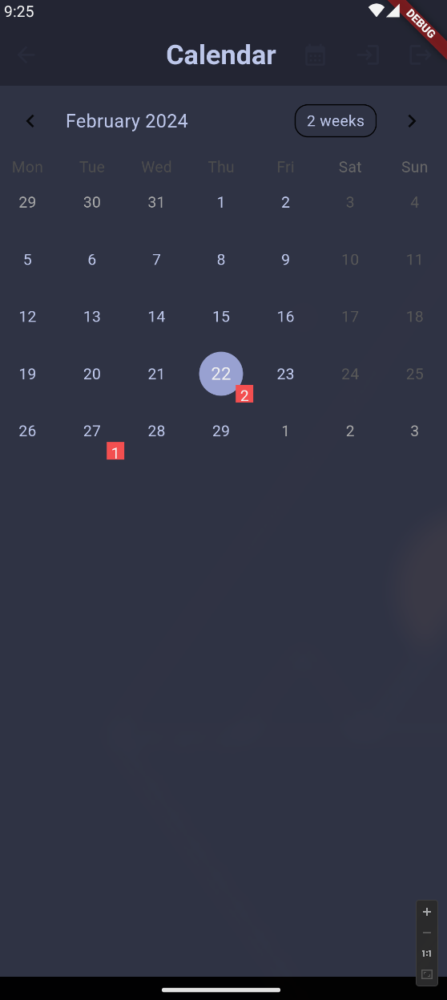
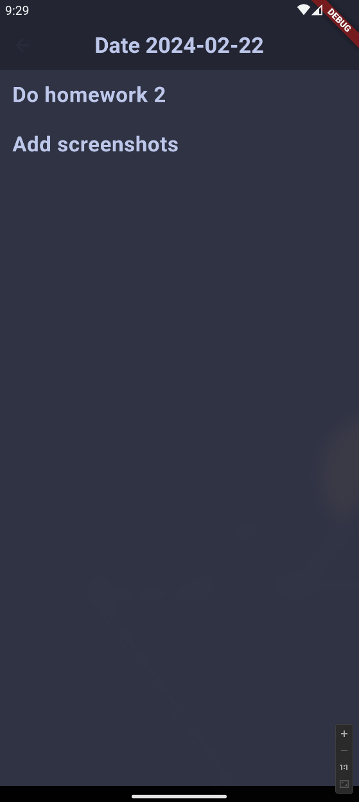

# Taskify

Taskify is a task management application designed to help users organize and prioritize
their daily tasks efficiently. It provides a user-friendly interface for creating,
tracking, and managing tasks.

## Features

- Custom UI elements
- State Menagement: Using the flutter bloc package.
- Folder based routing
- Creation, edit, deletion of tasks
- Notifications/reminders of tasks before due date
- Camera
- Dynamic theme mode (light and dark) switching based on ambient light sensors.
- Register and Login through firebase web service.
- Calendar view of tasks
- Pesistent storage of tasks

## Design Patterns

The application uses several design patterns:

- Composition-based Architecture: Elements of the UI are separated into reusable components
- Singleton: For the objects (like some services) that provide internal state menagement through out the application.
- Event-driven: UI and state is event driven, allowing for scalable developement.
- Separation of concerns: Separates the UI (presentation layer) from the business logic.
- Redux pattern: Through the bloc package which allows reactive UI changes.
- Builder pattern

## Installation

Requirements:

- Flutter installed
- Android Emulator installed

To install the dependencies and run the following commands in the terminal

This step is optional but it makes sure that the projects starts in a clean state:

```bash
flutter clean
```

For the application to compile and run the dependencies need to be installed with the following command:

```bash
flutter packages get
```

## Some Screnshots







## Author

| Name  | Lastname | Index  |
|-------|----------|--------|
| Haled | Odat     | 201516 |
